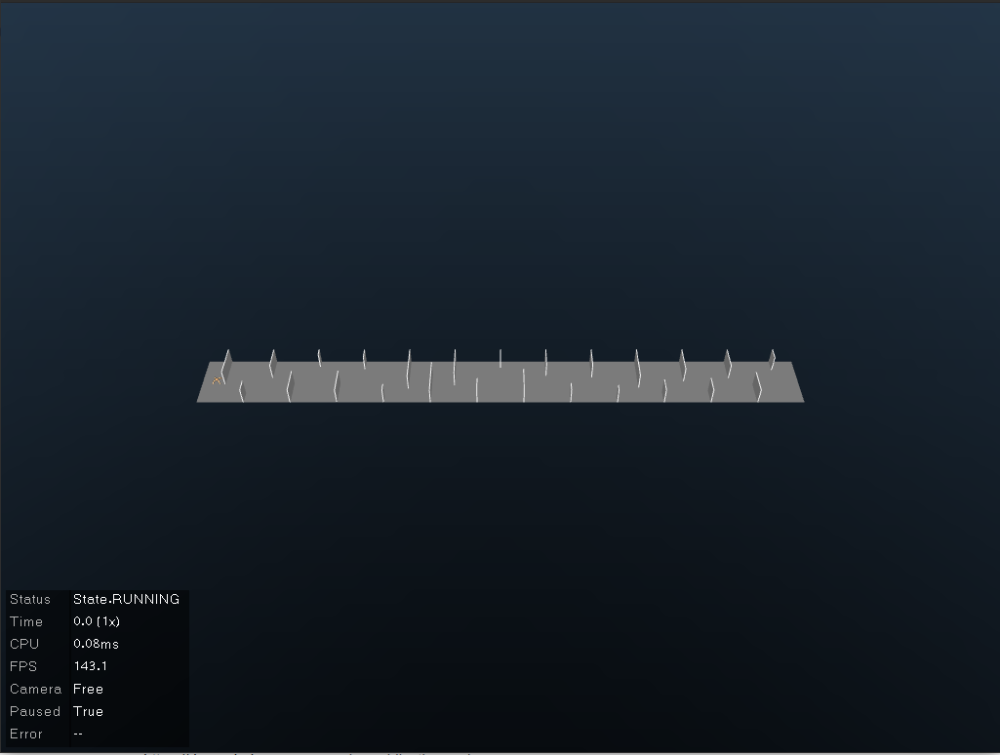
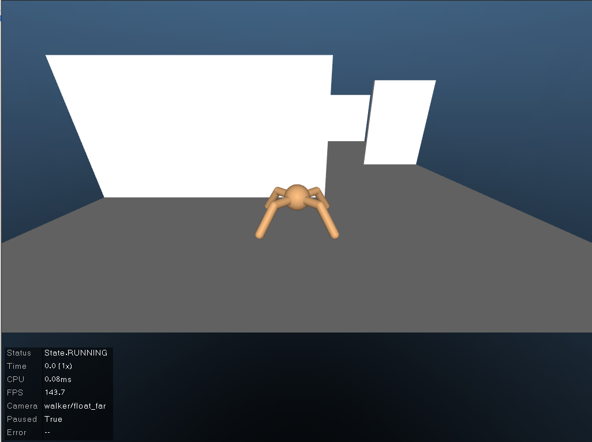

## Creating new envionments

#### Composer

1. An environment in general looks like something we can see in `env.py`. It consists of the `Physics` class which defines the physics of the bot and the task in which we define our objective. Once you have implemented your .py file, you just need to import it near the top of `suite/__init__.py`, and you should be able to use your environment.

2. Besides there are some robots , arenas and tasks that are precoded in the suite and can be used to create a new domain and task. Refer to `dm_env.py`. This creates a task consisting of an ant walking through an environment consisting of walls spawned randomly at the start of each episode. for registering the import as stated above must be done. The env looks like the images given below:

   

   

3. Further examples can be seen [here](https://colab.research.google.com/github/deepmind/dm_control/blob/master/tutorial.ipynb). 

4. Once the env is registered it can be trained as in the train module.

