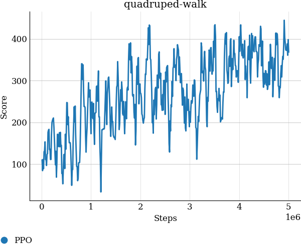

## Training a task in dm_control

1. After installation we will try to train a simple task consisting of a 4 legged bot called an `ant` and we will train it to walk. 

2. The algorithm we will use is [Proximal Policy Optimization(PPO)](https://openai.com/blog/openai-baselines-ppo/#ppo) from tonic RL library.

3. The script used for training is in the repo as `script.py` and `config.yaml` with the parameters. We will be using the task from the stander benchmark suite of `dm_control` with domain name `quadruped` and task name `walk`. 

4. We can perform the training in a distributed and parallel way too by changing the `parallel` and `sequential` flags.

5. For our purpose we would just use a single seed to illustrate that the task can be solved.

6. We can also use tonic to train for the task with the following syntax instead of the script:

   ```bash
   python -m tonic.train \
   --header 'import tonic.torch' \
   --agent 'tonic.torch.agents.PPO()' \
   --environment 'tonic.environments.ControlSuite("quadruped-walk")' \
   --seed 0
   ```

7. After training the result can be plotted by:

   ```bash
   python -m tonic.plot --path quadruped-walk/
   ```

8. The result can be rendered by:

   ```bash
   python -m tonic.play --path quadruped-walk/PPO/0
   ```

9. `train_plot_render.sh` script can be used directly to first train then show the plot and render.

10. A plot after training looks looks something like this. Even though it is trained for a single seed the score optimization with steps can be seen.

    

    

    